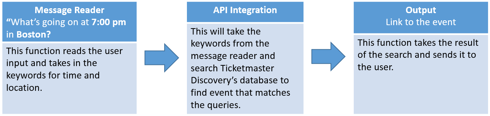

 

<h1 id="fl"> Todo Today Project Website</h1>

<h3 id="sub">What do YOU want to do today?</h3>

 

<h2 id="head1"> Big Idea </h2>

 We often find ourselves pondering on what to do on a Friday or Saturday night. Having to plan where to go every weekend is too much of a hassle. Hence, we came up with an idea to make a chatbot that will give us the result just by typing one question. We decided to do it on Facebook because Facebook has a complete user interface, hosted several bots such as NBA Awards, and have a large user base. 

<h2 id="head2"> Implementation Information </h2>

<h2 id="head3"> USER MANUAL </h2>

<h3> Libraries to install </h3>
Requests
Json
Base64
Pprint
datetime
ticketpy

<h3 id="subhead1"> How to run the code: </h3>

<h4> How to get started: </h4>
<ul>
<li>Login to Facebook Account/Create a Facebook Account.</li>
<li>Search “TodoToday Chatbot” on the searchbar.</li>
<li>Click on “Get Started” to initiate the chat.</li>
<li>Start giving inputs and talk to the Chatbot.</li>
</ul>
