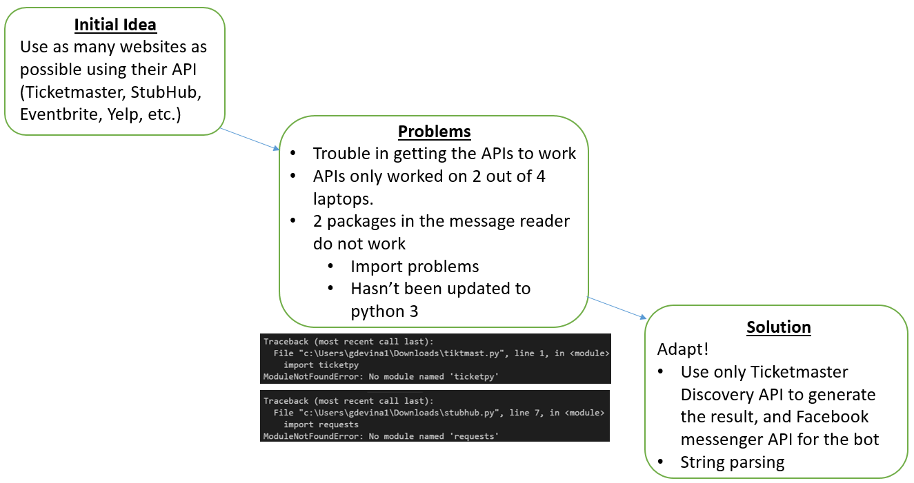

 

<h1 id="fl"> ToDoToday Project Website</h1>

<h3 id="sub">What do YOU want to do today?</h3>

 

<h2 class="head"> Big Idea </h2>

 We often find ourselves pondering on what to do on a Friday or Saturday night. Having to plan where to go every weekend is too much of a hassle. Hence, we came up with an idea to make a chatbot that will give us the result just by typing one question. We decided to do it on Facebook because Facebook has a complete user interface, hosted several bots such as NBA Awards, and have a large user base. 

 

<h2 class="head"> Implementation Information </h2>

 

<h2 class="head"> USER MANUAL </h2>

<h3 class="subhead"> Libraries to install </h3>
<ul>
<li>Flask==0.11.1</li>
<li>Json</li>
<li>Jinja2==2.8</li>
<li>MarkupSafe==0.23</li>
<li>Wekzeug==0.11.10</li>
<li>click==6.6</li>
<li>gunicorn==19.6.0</li>
<li>itsdangerous==0.24</li>
<li>requests==2.10.0</li>
<li>wsgiref==0.1.2</li>
</ul>

<h4 class="subheadsm"> How to get started: </h4>
<ul>
<li>Login to Facebook Account/Create a Facebook Account.</li>
<li>Search “TodoToday Chatbot” on the searchbar.</li>
<li>Click on “Get Started” to initiate the chat.</li>
<li>Start giving inputs and talk to the Chatbot.</li>
<li class="indentation">Input suggestion: “What's going on at 7:00 pm in Boston?"</li>

</ul>

 

<h2 class="head"> Project Evolution </h2>

 

<h2 class="head"> Attribution </h2>

Completely self made!

 Used <a href="https://blog.hartleybrody.com/fb-messenger-bot/" target="_blank"> Hartley Brody's function </a>to send message back to user in the webhook.

 
 
